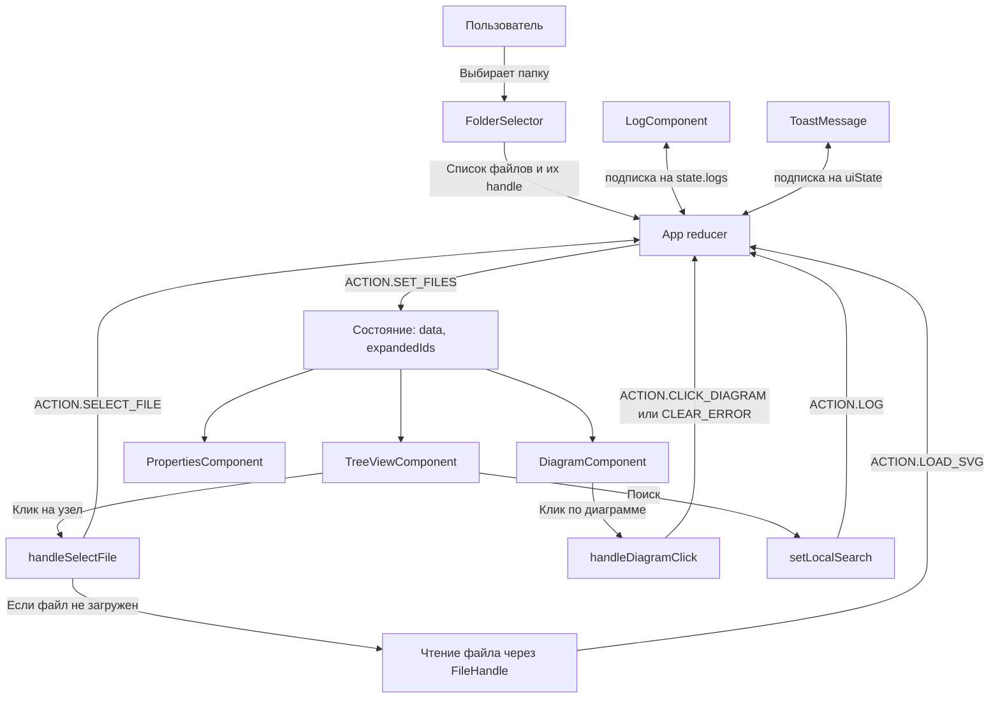

Мы подготовили полностью автономное веб-приложение на React, которое при запуске предлагает выбрать папку с SVG-файлами (через File System Access API). После выбора папки программа сканирует все `.svg`-файлы, строит иерархическое дерево на основе имён (например, `file1.svg` становится родителем для `file1-1.svg` и `file1-2.svg`). При клике на узел файл читается и отображается в окне диаграммы, а свойства извлекаются из его содержимого. Все действия логируются в нижнем окне. Код снабжён подробными комментариями, разбит на группы функций, а также содержит mermaid-диаграммы, иллюстрирующие архитектуру и взаимодействие компонентов. В отдельном файле `instruction.md` даны рекомендации по доработке с примерами функционального программирования.

---

### Файл `index.html` (полный код)


---

### Описание кода и архитектура (mermaid-диаграммы)

Вот как выглядит взаимодействие компонентов и поток данных:



**Поток данных:**
1. Пользователь выбирает папку – `FolderSelector` вызывает `onSelectFolder`.
2. `App` диспатчит `SET_FILES`, который строит дерево из имён файлов и сохраняет `fileHandles`.
3. `TreeViewComponent` отображает дерево, используя `data` и `expandedIds`.
4. При клике на узел вызывается `handleSelectFile`, который диспатчит `SELECT_FILE` и, если это файл без содержимого, инициирует чтение через File API.
5. После чтения диспатчится `LOAD_SVG`, обновляя узел с содержимым и свойствами.
6. `DiagramComponent` отображает SVG, `PropertiesComponent` – свойства.
7. Все действия логируются через `LOG`.

---

### Использование функционального программирования для доработки

Программа активно использует **функциональный подход**:
- Чистые функции: `extractStagesFromSVG`, `extractPropertiesFromSVG`, `buildTreeFromFileNames`.
- Неизменяемое состояние через `reducer`.
- Композиция функций: например, `buildTreeFromFileNames` использует `map`, `filter`, `reduce` для построения дерева.
- **Пример для новичка**: чтобы добавить новый файл, достаточно поместить его в папку и нажать «Обновить» – дерево перестроится автоматически. Или можно вручную добавить имя в список `fileNames` в коде, если вы генерируете данные иначе.

---

### Файл `instruction.md` (подробное описание групп и рекомендации)


## 3. Управление свёрнутостью ветвей
- Начальное состояние: все папки (узлы с детьми) развёрнуты.
- Кнопки «Развернуть всё» и «Свернуть всё» изменяют `expandedIds`.
- Чтобы изменить начальное состояние, отредактируйте код в `handleSelectFolder`, где создаётся `expandedIds`.

## 4. Рекомендации по разработке
- **Безопасность**: при встраивании SVG из файлов используйте санитизацию (DOMPurify), если файлы поступают из ненадёжных источников.
- **Производительность**: при большом количестве файлов используйте виртуализацию списка.
- **Тестирование**: выделите утилиты в отдельные модули для юнит-тестов.
- **Расширяемость**: для поддержки других форматов (PNG, PDF) добавьте соответствующие обработчики в `DiagramComponent`.
- **Офлайн-работа**: все операции локальные, сервер не требуется.

## 5. Использование функционального программирования
- **Map, filter, reduce** – активно применяются в `buildTreeFromFileNames`.
- **Чистые функции** – все утилиты не имеют побочных эффектов.
- **Неизменяемость** – состояние обновляется через reducer, создавая новые объекты.
- **Композиция** – функции можно комбинировать: например, `extractPropertiesFromSVG` вызывает `extractStagesFromSVG`.

## 6. Пример работы с mermaid-диаграммой
Код включает в комментариях описание взаимодействия компонентов. Вы можете скопировать его в онлайн-редактор mermaid для визуализации.

## 7. Заключение
Программа полностью готова к использованию. Для её работы требуется браузер с поддержкой File System Access API (Chrome, Edge). После выбора папки дерево строится автоматически, файлы загружаются по требованию при клике.
```
