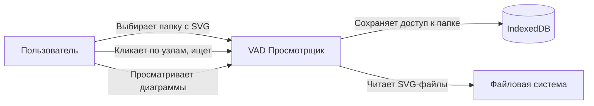
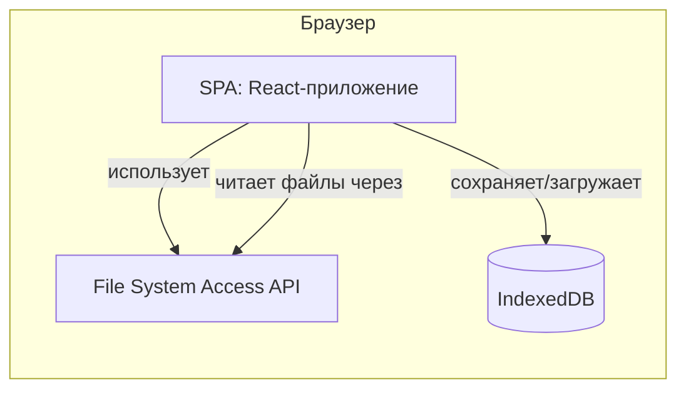
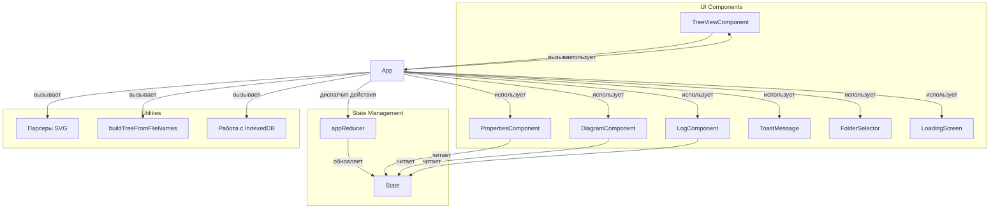

Мы подготовили финальную версию приложения с вынесенными стилями в отдельный файл и полным описанием архитектуры в нотации C4 (Context, Containers, Components, Code). Всё работает локально без сервера, конфиг встроен в HTML, а стили выделены для удобства поддержки. Ниже представлены все необходимые файлы и подробное описание.

---

## 1. Файл `styles.css` (все стили)

```css
/* ========================================================================
   ГЛОБАЛЬНЫЙ СБРОС И БАЗОВЫЕ СТИЛИ
   ======================================================================== */
* {
    box-sizing: border-box;
    margin: 0;
    padding: 0;
}

body {
    font-family: 'Segoe UI', Tahoma, Geneva, Verdana, sans-serif;
    background: #f0f2f5;
    color: #1e293b;
    height: 100vh;
    overflow: hidden;
    padding: 12px;
}

#root {
    height: 100%;
    display: flex;
    flex-direction: column;
    gap: 8px;
}

/* ========================================================================
   ОСНОВНАЯ СЕТКА
   ======================================================================== */
.app-main {
    flex: 1;
    display: grid;
    grid-template-columns: 340px 1fr;
    gap: 8px;
    min-height: 0;
}

.left-panel {
    display: flex;
    flex-direction: column;
    gap: 8px;
    min-height: 0;
}

/* ========================================================================
   ОКНА (WINDOWS)
   ======================================================================== */
.window {
    background: #ffffff;
    border-radius: 12px;
    box-shadow: 0 2px 8px rgba(0, 0, 0, 0.08);
    display: flex;
    flex-direction: column;
    border: 1px solid #e9edf2;
    overflow: hidden;
}

.window-header {
    padding: 10px 16px;
    background: #f8fafc;
    border-bottom: 1px solid #e9edf2;
    font-weight: 600;
    font-size: 14px;
    color: #0f172a;
    display: flex;
    align-items: center;
    gap: 8px;
    flex-shrink: 0;
    flex-wrap: wrap;
}

.window-header .badge {
    font-size: 11px;
    background: #dbeafe;
    color: #1d4ed8;
    padding: 0 8px;
    border-radius: 20px;
    font-weight: 400;
}

.window-body {
    flex: 1;
    padding: 12px 16px;
    overflow: auto;
    min-height: 0;
}

/* ========================================================================
   ПАНЕЛЬ ИНСТРУМЕНТОВ ДЕРЕВА
   ======================================================================== */
.treeview-toolbar {
    display: flex;
    flex-wrap: wrap;
    gap: 6px;
    margin-bottom: 10px;
    align-items: center;
}

.treeview-toolbar input[type="text"] {
    flex: 1;
    min-width: 100px;
    padding: 5px 10px;
    border: 1px solid #d1d9e6;
    border-radius: 6px;
    font-size: 13px;
    outline: none;
}

.treeview-toolbar input[type="text"]:focus {
    border-color: #4f46e5;
    box-shadow: 0 0 0 2px rgba(79, 70, 229, 0.2);
}

/* ========================================================================
   КНОПКИ
   ======================================================================== */
.btn {
    padding: 4px 12px;
    border: none;
    border-radius: 6px;
    font-size: 13px;
    font-weight: 500;
    cursor: pointer;
    background: #e9edf2;
    color: #1e293b;
    transition: background 0.15s;
    white-space: nowrap;
}

.btn:hover {
    background: #d1d9e6;
}

.btn-primary {
    background: #4f46e5;
    color: white;
}

.btn-primary:hover {
    background: #4338ca;
}

.btn-danger {
    background: #ef4444;
    color: white;
}

.btn-danger:hover {
    background: #dc2626;
}

.btn-success {
    background: #22c55e;
    color: white;
}

.btn-success:hover {
    background: #16a34a;
}

.btn-warning {
    background: #f59e0b;
    color: white;
}

.btn-warning:hover {
    background: #d97706;
}

/* ========================================================================
   УЗЛЫ ДЕРЕВА
   ======================================================================== */
.tree-node {
    display: flex;
    align-items: center;
    padding: 4px 8px 4px 4px;
    cursor: pointer;
    border-radius: 4px;
    transition: background 0.1s;
    gap: 4px;
    user-select: none;
}

.tree-node:hover {
    background: #f1f5f9;
}

.tree-node.selected {
    background: #eef2ff;
}

.tree-node .icon {
    width: 20px;
    text-align: center;
    font-size: 16px;
    flex-shrink: 0;
}

.tree-node .label {
    flex: 1;
    white-space: nowrap;
    overflow: hidden;
    text-overflow: ellipsis;
    font-size: 14px;
}

.tree-node .status {
    font-size: 11px;
    color: #94a3b8;
    margin-left: 4px;
}

.tree-node .chevron {
    font-size: 12px;
    color: #94a3b8;
    width: 18px;
    text-align: center;
    flex-shrink: 0;
    transition: transform 0.2s;
}

.tree-node .chevron.open {
    transform: rotate(90deg);
}

.tree-children {
    padding-left: 24px;
}

.tree-empty {
    color: #94a3b8;
    font-style: italic;
    padding: 12px 0;
    text-align: center;
}

/* ========================================================================
   СВОЙСТВА (PROPERTIES)
   ======================================================================== */
.property-row {
    display: flex;
    padding: 4px 0;
    border-bottom: 1px solid #f1f5f9;
    font-size: 14px;
}

.property-key {
    width: 120px;
    font-weight: 500;
    color: #475569;
    flex-shrink: 0;
}

.property-value {
    flex: 1;
    color: #0f172a;
    word-break: break-word;
}

.property-empty {
    color: #94a3b8;
    font-style: italic;
    font-size: 14px;
    padding: 12px 0;
}

/* ========================================================================
   ДИАГРАММА
   ======================================================================== */
.diagram-window .window-body {
    display: flex;
    align-items: center;
    justify-content: center;
    background: #fafcff;
    padding: 16px;
}

.diagram-container {
    width: 100%;
    height: 100%;
    display: flex;
    align-items: center;
    justify-content: center;
    min-height: 200px;
}

.diagram-container svg {
    max-width: 100%;
    max-height: 100%;
    border-radius: 8px;
    background: white;
    box-shadow: 0 1px 4px rgba(0, 0, 0, 0.06);
}

.diagram-placeholder {
    color: #94a3b8;
    font-size: 16px;
    text-align: center;
    padding: 40px 20px;
}

.diagram-placeholder .big-icon {
    font-size: 48px;
    display: block;
    margin-bottom: 12px;
}

/* ========================================================================
   СООБЩЕНИЕ ОБ ОШИБКЕ (TOAST)
   ======================================================================== */
.toast-message {
    position: fixed;
    bottom: 90px;
    left: 50%;
    transform: translateX(-50%);
    background: #fef2f2;
    color: #b91c1c;
    padding: 12px 28px;
    border-radius: 12px;
    border: 1px solid #fecaca;
    box-shadow: 0 8px 32px rgba(0, 0, 0, 0.12);
    font-weight: 500;
    font-size: 15px;
    z-index: 1000;
    animation: slideUp 0.3s ease;
    pointer-events: none;
    transition: opacity 0.3s, transform 0.3s;
}

.toast-message.hidden {
    opacity: 0;
    transform: translateX(-50%) translateY(20px);
}

@keyframes slideUp {
    from {
        opacity: 0;
        transform: translateX(-50%) translateY(20px);
    }
    to {
        opacity: 1;
        transform: translateX(-50%) translateY(0);
    }
}

/* ========================================================================
   ЛОГ
   ======================================================================== */
.log-window {
    height: 160px;
    flex-shrink: 0;
}

.log-window .window-body {
    padding: 6px 12px;
    font-family: 'Consolas', 'Monaco', monospace;
    font-size: 12px;
    background: #0f172a;
    color: #e2e8f0;
    overflow-y: auto;
    line-height: 1.6;
}

.log-entry {
    display: flex;
    gap: 12px;
    padding: 2px 0;
    border-bottom: 1px solid rgba(255, 255, 255, 0.04);
}

.log-entry .log-time {
    color: #64748b;
    flex-shrink: 0;
    min-width: 70px;
}

.log-entry .log-group {
    color: #60a5fa;
    flex-shrink: 0;
    min-width: 90px;
    font-weight: 500;
}

.log-entry .log-msg {
    color: #e2e8f0;
    flex: 1;
}

.log-empty {
    color: #475569;
    font-style: italic;
    padding: 8px 0;
}

/* ========================================================================
   ИНФОРМАЦИЯ О ПАПКЕ
   ======================================================================== */
.folder-info {
    padding: 4px 12px;
    background: #f1f5f9;
    border-radius: 8px;
    font-size: 13px;
    display: flex;
    gap: 10px;
    align-items: center;
}

.folder-info .path {
    font-weight: 500;
    flex: 1;
    overflow: hidden;
    text-overflow: ellipsis;
    white-space: nowrap;
}

/* ========================================================================
   СКРОЛЛБАРЫ
   ======================================================================== */
.window-body::-webkit-scrollbar {
    width: 4px;
    height: 4px;
}

.window-body::-webkit-scrollbar-track {
    background: transparent;
}

.window-body::-webkit-scrollbar-thumb {
    background: #cbd5e1;
    border-radius: 8px;
}

.window-body::-webkit-scrollbar-thumb:hover {
    background: #94a3b8;
}

/* ========================================================================
   АДАПТИВНОСТЬ
   ======================================================================== */
@media (max-width: 720px) {
    .app-main {
        grid-template-columns: 1fr;
        grid-template-rows: 1fr 1fr;
    }
    .left-panel {
        flex-direction: row;
    }
    .left-panel .window {
        flex: 1;
        min-width: 0;
    }
    .log-window {
        height: 120px;
    }
    .property-key {
        width: 70px;
    }
}

@media (max-width: 500px) {
    .left-panel {
        flex-direction: column;
    }
    .app-main {
        grid-template-rows: 1fr 1fr 1fr;
    }
}
```

---

## 2. Файл `index.html` (основной, с подключением стилей)

```html
<!DOCTYPE html>
<html lang="ru">
<head>
    <meta charset="UTF-8" />
    <meta name="viewport" content="width=device-width, initial-scale=1.0" />
    <title>VAD Просмотрщик (встроенный конфиг)</title>
    <!-- Подключаем внешний файл стилей -->
    <link rel="stylesheet" href="styles.css" />
</head>
<body>
    <div id="root"></div>

    <!-- Подключаем React, ReactDOM, Babel -->
    <script crossorigin src="https://unpkg.com/react@18/umd/react.production.min.js"></script>
    <script crossorigin src="https://unpkg.com/react-dom@18/umd/react-dom.production.min.js"></script>
    <script src="https://unpkg.com/@babel/standalone/babel.min.js"></script>

    <!-- ===== ВСТРАИВАЕМ КОНФИГ ПРЯМО В HTML ===== -->
    <script>
        // Конфигурация приложения — встроена в страницу, не требует внешнего файла
        window.CONFIG = {
            folderPath: './svg',  // только для отображения, не влияет на загрузку
            defaultExpanded: true,
            maxStages: 8,
        };
        window.CONFIG_YAML = `
folderPath: "./svg"
defaultExpanded: true
maxStages: 8
`;
        console.log('Конфигурация загружена (YAML):', window.CONFIG_YAML);
        console.log('Объект конфига:', window.CONFIG);
    </script>

    <!-- ===== ОСНОВНОЙ КОД ПРИЛОЖЕНИЯ ===== -->
    <script type="text/babel">
        /* ========================================================================
           ГРУППА 1: УТИЛИТЫ ДЛЯ РАБОТЫ С ФАЙЛАМИ И SVG
           ======================================================================== */

        /**
         * Извлекает названия этапов из SVG-текста.
         * Анализирует все элементы <text>, игнорируя заголовок и подпись.
         * @param {string} svgText - содержимое SVG-файла
         * @returns {string[]} массив названий этапов
         */
        function extractStagesFromSVG(svgText) {
            const parser = new DOMParser();
            const doc = parser.parseFromString(svgText, 'image/svg+xml');
            const rects = doc.querySelectorAll('rect');
            const texts = doc.querySelectorAll('text');
            const stageTexts = [];
            texts.forEach(text => {
                const content = text.textContent.trim();
                if (!content.includes('Количество этапов') &&
                    !content.includes('диаграмма') &&
                    content.length > 0) {
                    stageTexts.push(content);
                }
            });
            if (stageTexts.length > 0 && stageTexts.length === rects.length - 1) {
                return stageTexts;
            } else {
                const count = Math.max(rects.length - 1, 5);
                return Array.from({ length: count }, (_, i) => `Этап ${i+1}`);
            }
        }

        /**
         * Формирует объект свойств на основе извлечённых этапов.
         * @param {string} svgText - содержимое SVG-файла
         * @returns {Object} объект со свойствами
         */
        function extractPropertiesFromSVG(svgText) {
            const stages = extractStagesFromSVG(svgText);
            return {
                'Количество этапов': stages.length,
                'Этапы': stages.join(' → '),
                'Длительность (план)': (stages.length * 2) + ' дн.',
                'Ответственный': 'Отдел развития',
                'Версия': '1.0',
                'Дата создания': new Date().toLocaleDateString('ru-RU'),
                'Тип': 'VAD-диаграмма (загружена)',
            };
        }

        /**
         * Построение иерархического дерева из списка имён файлов (с расширением .svg).
         * Правило: если имя содержит дефис, то первая часть считается родителем.
         * Пример: "file1-1.svg" → родитель "file1.svg"
         * @param {string[]} fileNames - массив полных имён файлов (например, ["file1.svg", "file1-1.svg"])
         * @returns {Object} объект данных дерева, где ключ — id узла, значение — узел
         */
        function buildTreeFromFileNames(fileNames) {
            const nodes = {};
            fileNames.forEach(fullName => {
                nodes[fullName] = {
                    id: fullName,
                    name: fullName,
                    children: [],
                    loaded: false,
                    svgContent: null,
                    properties: {},
                    stages: [],
                };
            });

            const rootIds = [];
            const childMap = {};
            fileNames.forEach(fullName => {
                const parts = fullName.replace(/\.svg$/i, '').split('-');
                if (parts.length > 1) {
                    const parentBase = parts.slice(0, -1).join('-');
                    const parentFull = parentBase + '.svg';
                    if (nodes[parentFull]) {
                        nodes[parentFull].children.push(fullName);
                        childMap[fullName] = parentFull;
                    } else {
                        rootIds.push(fullName);
                    }
                } else {
                    rootIds.push(fullName);
                }
            });
            const uniqueRoots = [...new Set(rootIds)];
            const filteredRoots = uniqueRoots.filter(id => !childMap[id]);

            const root = {
                id: 'root',
                name: 'Корень',
                children: filteredRoots,
                loaded: true,
                svgContent: null,
                properties: {},
                stages: [],
            };

            const data = { root };
            Object.keys(nodes).forEach(key => { data[key] = nodes[key]; });
            return data;
        }

        /* ========================================================================
           ГРУППА 2: УПРАВЛЕНИЕ СОСТОЯНИЕМ (REDUCER)
           ======================================================================== */

        const ACTION_TYPES = {
            SELECT_FILE: 'SELECT_FILE',
            CLICK_DIAGRAM: 'CLICK_DIAGRAM',
            CLEAR_ERROR: 'CLEAR_ERROR',
            LOG: 'LOG',
            SET_FILES: 'SET_FILES',
            LOAD_SVG: 'LOAD_SVG',
            EXPAND_ALL: 'EXPAND_ALL',
            COLLAPSE_ALL: 'COLLAPSE_ALL',
            SET_EXPANDED: 'SET_EXPANDED',
            SET_FOLDER_PATH: 'SET_FOLDER_PATH',
            SET_LOADING: 'SET_LOADING',
        };

        /**
         * Создаёт запись лога с временем.
         * @param {string} group - группа действия (например, "Выбор", "Загрузка")
         * @param {string} message - текст сообщения
         * @returns {Object} запись лога
         */
        function createLogEntry(group, message) {
            const now = new Date();
            const time = now.toLocaleTimeString('ru-RU', { hour12: false });
            return { time, group, message };
        }

        const INITIAL_STATE = {
            data: null,               // дерево узлов
            selectedFile: null,       // id выбранного узла
            uiState: 'NO_SELECTION',  // 'NO_SELECTION' | 'FILE_SELECTED' | 'ERROR_NO_SELECTION'
            errorMessage: null,
            logs: [],
            expandedIds: new Set(),   // множество id раскрытых узлов
            searchQuery: '',
            folderPath: '',
            fileHandles: {},          // Map: имя файла -> FileHandle
            isLoading: false,
        };

        /**
         * Чистый редьюсер, описывающий все переходы между состояниями.
         * @param {Object} state - текущее состояние
         * @param {Object} action - действие
         * @returns {Object} новое состояние
         */
        function appReducer(state, action) {
            switch (action.type) {
                case ACTION_TYPES.SET_LOADING:
                    return { ...state, isLoading: action.payload };
                case ACTION_TYPES.SET_FOLDER_PATH:
                    return { ...state, folderPath: action.payload };
                case ACTION_TYPES.SET_FILES: {
                    const { fileNames, fileHandles } = action.payload;
                    const data = buildTreeFromFileNames(fileNames);
                    const folderIds = Object.keys(data).filter(id => data[id].children && data[id].children.length > 0);
                    const expanded = new Set(['root', ...folderIds]);
                    const logEntry = createLogEntry('Система', `Загружено ${fileNames.length} файлов из папки`);
                    return {
                        ...state,
                        data,
                        expandedIds: expanded,
                        fileHandles,
                        logs: [...state.logs, logEntry],
                        uiState: 'NO_SELECTION',
                        selectedFile: null,
                    };
                }
                case ACTION_TYPES.SELECT_FILE: {
                    const { fileId } = action.payload;
                    const node = state.data ? state.data[fileId] : null;
                    if (!node) {
                        return {
                            ...state,
                            logs: [...state.logs, createLogEntry('Ошибка', `Узел "${fileId}" не найден`)],
                        };
                    }
                    let newUiState = 'FILE_SELECTED';
                    let errorMessage = null;
                    if (state.uiState === 'ERROR_NO_SELECTION') errorMessage = null;
                    const isFile = !node.children || node.children.length === 0;
                    // Логируем только выбор файла (не папки)
                    const logEntry = isFile ?
                        createLogEntry('Выбор', `Выбран файл "${node.name}"`) :
                        null;
                    const newLogs = isFile ? [...state.logs, logEntry] : state.logs;
                    return {
                        ...state,
                        selectedFile: fileId,
                        uiState: newUiState,
                        errorMessage,
                        logs: newLogs,
                    };
                }
                case ACTION_TYPES.LOAD_SVG: {
                    const { fileId, svgContent } = action.payload;
                    const node = state.data[fileId];
                    if (!node) return state;
                    const stages = extractStagesFromSVG(svgContent);
                    const properties = extractPropertiesFromSVG(svgContent);
                    const updatedNode = {
                        ...node,
                        svgContent,
                        stages,
                        properties,
                        loaded: true,
                    };
                    const newData = { ...state.data, [fileId]: updatedNode };
                    const logEntry = createLogEntry('Загрузка', `Загружен SVG для "${node.name}" (${stages.length} этапов)`);
                    return {
                        ...state,
                        data: newData,
                        logs: [...state.logs, logEntry],
                    };
                }
                case ACTION_TYPES.CLICK_DIAGRAM: {
                    if (state.selectedFile === null) {
                        const errorMsg = 'Не выбран элемент treeview';
                        return {
                            ...state,
                            uiState: 'ERROR_NO_SELECTION',
                            errorMessage: errorMsg,
                            logs: [...state.logs, createLogEntry('Ошибка', errorMsg)],
                        };
                    }
                    const node = state.data[state.selectedFile];
                    if (node && node.children && node.children.length > 0) {
                        return state; // папка — игнорируем
                    }
                    const logEntry = createLogEntry('Диаграмма', `Просмотр диаграммы "${node ? node.name : state.selectedFile}"`);
                    return {
                        ...state,
                        uiState: 'FILE_SELECTED',
                        logs: [...state.logs, logEntry],
                    };
                }
                case ACTION_TYPES.CLEAR_ERROR: {
                    if (state.uiState === 'ERROR_NO_SELECTION') {
                        return {
                            ...state,
                            uiState: 'NO_SELECTION',
                            errorMessage: null,
                            logs: [...state.logs, createLogEntry('Система', 'Ошибка сброшена')],
                        };
                    }
                    return state;
                }
                case ACTION_TYPES.LOG: {
                    const { message, group } = action.payload;
                    return {
                        ...state,
                        logs: [...state.logs, createLogEntry(group || 'Система', message)],
                    };
                }
                case ACTION_TYPES.EXPAND_ALL: {
                    if (!state.data) return state;
                    const allFolderIds = Object.keys(state.data).filter(id => state.data[id].children && state.data[id].children.length > 0);
                    return {
                        ...state,
                        expandedIds: new Set(allFolderIds),
                    };
                }
                case ACTION_TYPES.COLLAPSE_ALL: {
                    return {
                        ...state,
                        expandedIds: new Set(['root']),
                    };
                }
                case ACTION_TYPES.SET_EXPANDED: {
                    const { expandedIds } = action.payload;
                    return {
                        ...state,
                        expandedIds,
                    };
                }
                default:
                    return state;
            }
        }

        /* ========================================================================
           ГРУППА 3: РАБОТА С INDEXEDDB ДЛЯ СОХРАНЕНИЯ HANDLE
           ======================================================================== */

        const DB_NAME = 'VADViewerDB';
        const STORE_NAME = 'handles';
        const KEY = 'folderHandle';

        /**
         * Открывает соединение с IndexedDB.
         * @returns {Promise<IDBDatabase>}
         */
        function openDB() {
            return new Promise((resolve, reject) => {
                const request = indexedDB.open(DB_NAME, 1);
                request.onupgradeneeded = (event) => {
                    const db = event.target.result;
                    if (!db.objectStoreNames.contains(STORE_NAME)) {
                        db.createObjectStore(STORE_NAME);
                    }
                };
                request.onsuccess = () => resolve(request.result);
                request.onerror = () => reject(request.error);
            });
        }

        /**
         * Сохраняет FileSystemDirectoryHandle в IndexedDB.
         * @param {FileSystemDirectoryHandle} handle
         */
        async function saveHandle(handle) {
            const db = await openDB();
            return new Promise((resolve, reject) => {
                const tx = db.transaction(STORE_NAME, 'readwrite');
                const store = tx.objectStore(STORE_NAME);
                store.put(handle, KEY);
                tx.oncomplete = () => resolve();
                tx.onerror = () => reject(tx.error);
            });
        }

        /**
         * Загружает сохранённый FileSystemDirectoryHandle из IndexedDB.
         * @returns {Promise<FileSystemDirectoryHandle|null>}
         */
        async function loadHandle() {
            const db = await openDB();
            return new Promise((resolve, reject) => {
                const tx = db.transaction(STORE_NAME, 'readonly');
                const store = tx.objectStore(STORE_NAME);
                const request = store.get(KEY);
                request.onsuccess = () => resolve(request.result);
                request.onerror = () => reject(request.error);
            });
        }

        /* ========================================================================
           ГРУППА 4: REACT-КОМПОНЕНТЫ
           ======================================================================== */

        // ---- 4.1 Загрузка ----
        function LoadingScreen() {
            return (
                <div style={{ display: 'flex', justifyContent: 'center', alignItems: 'center', height: '100%' }}>
                    <div style={{ textAlign: 'center' }}>
                        <div style={{ fontSize: '48px', marginBottom: '20px' }}>⏳</div>
                        <h2>Загрузка файлов...</h2>
                        <p style={{ color: '#64748b' }}>Пожалуйста, подождите</p>
                    </div>
                </div>
            );
        }

        // ---- 4.2 Выбор папки ----
        function FolderSelector({ onSelectFolder }) {
            const handleSelect = async () => {
                try {
                    const dirHandle = await window.showDirectoryPicker();
                    onSelectFolder(dirHandle);
                } catch (err) {
                    if (err.name !== 'AbortError') {
                        alert('Ошибка при выборе папки: ' + err.message);
                    }
                }
            };

            return (
                <div style={{ display: 'flex', justifyContent: 'center', alignItems: 'center', height: '100%' }}>
                    <div style={{ textAlign: 'center', padding: '40px' }}>
                        <div style={{ fontSize: '64px', marginBottom: '20px' }}>📂</div>
                        <h2>Выберите папку с SVG-файлами</h2>
                        <p style={{ color: '#64748b', marginBottom: '20px' }}>
                            В папке должны быть .svg файлы, имена которых определяют иерархию<br />
                            (например, file1.svg, file1-1.svg, file1-2.svg, file2.svg, file2-1.svg)
                        </p>
                        <button className="btn btn-primary" onClick={handleSelect} style={{ fontSize: '16px', padding: '10px 30px' }}>
                            Выбрать папку
                        </button>
                        <div style={{ marginTop: '20px', fontSize: '13px', color: '#94a3b8' }}>
                            (требуется браузер с поддержкой File System Access API)
                        </div>
                    </div>
                </div>
            );
        }

        // ---- 4.3 Рекурсивный рендеринг узлов дерева ----
        function renderTreeNodes({
            nodeId,
            data,
            expandedIds,
            selectedId,
            searchQuery,
            onSelect,
            onToggle,
            depth = 0,
        }) {
            const node = data[nodeId];
            if (!node) return null;

            // Фильтрация по поисковому запросу (рекурсивно проверяем поддерево)
            function hasMatchInSubtree(id) {
                const n = data[id];
                if (!n) return false;
                if (n.name.toLowerCase().includes(searchQuery.toLowerCase())) return true;
                if (n.children) {
                    for (const cid of n.children) {
                        if (hasMatchInSubtree(cid)) return true;
                    }
                }
                return false;
            }

            if (searchQuery && !hasMatchInSubtree(nodeId)) return null;

            const isSelected = (selectedId === nodeId);
            const isExpanded = expandedIds.has(nodeId);
            const hasChildren = node.children && node.children.length > 0;
            const icon = hasChildren ? '📁' : '📄';
            const status = node.loaded ? '✅' : (hasChildren ? '' : '⬇️');

            return (
                <div key={nodeId}>
                    <div
                        className={`tree-node ${isSelected ? 'selected' : ''}`}
                        style={{ paddingLeft: `${8 + depth * 20}px` }}
                        onClick={() => onSelect(nodeId)}
                    >
                        <span className="icon">{icon}</span>
                        <span className="label">{node.name}</span>
                        <span className="status">{status}</span>
                        {hasChildren && (
                            <span
                                className={`chevron ${isExpanded ? 'open' : ''}`}
                                onClick={(e) => {
                                    e.stopPropagation();
                                    onToggle(nodeId);
                                }}
                            >
                                ▶
                            </span>
                        )}
                    </div>
                    {hasChildren && isExpanded && (
                        <div className="tree-children">
                            {node.children.map((childId) =>
                                renderTreeNodes({
                                    nodeId: childId,
                                    data,
                                    expandedIds,
                                    selectedId,
                                    searchQuery,
                                    onSelect,
                                    onToggle,
                                    depth: depth + 1,
                                })
                            )}
                        </div>
                    )}
                </div>
            );
        }

        // ---- 4.4 Компонент дерева ----
        function TreeViewComponent({
            data,
            expandedIds,
            selectedFile,
            searchQuery,
            onSelectFile,
            onToggleExpand,
            onExpandAll,
            onCollapseAll,
            onSearchChange,
            onRefresh,
        }) {
            const rootChildren = data && data['root'] ? data['root'].children || [] : [];
            return (
                <div className="window">
                    <div className="window-header">
                        📂 Дерево файлов (компонент TreeView)
                        <span className="badge">{data ? Object.keys(data).length - 1 : 0} узлов</span>
                    </div>
                    <div className="window-body">
                        <div className="treeview-toolbar">
                            <input
                                type="text"
                                placeholder="Поиск..."
                                value={searchQuery}
                                onChange={(e) => onSearchChange(e.target.value)}
                            />
                            <button className="btn" onClick={onExpandAll}>🔽 Развернуть всё</button>
                            <button className="btn" onClick={onCollapseAll}>▶️ Свернуть всё</button>
                            <button className="btn btn-warning" onClick={onRefresh}>🔄 Обновить</button>
                        </div>
                        <div>
                            {rootChildren.length === 0 ? (
                                <div className="tree-empty">Нет файлов в папке</div>
                            ) : (
                                rootChildren.map((childId) =>
                                    renderTreeNodes({
                                        nodeId: childId,
                                        data,
                                        expandedIds,
                                        selectedId: selectedFile,
                                        searchQuery,
                                        onSelect: onSelectFile,
                                        onToggle: onToggleExpand,
                                        depth: 0,
                                    })
                                )
                            )}
                        </div>
                    </div>
                </div>
            );
        }

        // ---- 4.5 Компонент свойств ----
        function PropertiesComponent({ fileId, data }) {
            const node = fileId && data ? data[fileId] : null;
            return (
                <div className="window">
                    <div className="window-header">
                        📋 Свойства (компонент Properties)
                        <span className="badge">{node ? node.name : 'не выбран'}</span>
                    </div>
                    <div className="window-body">
                        {node ? (
                            <div>
                                {Object.entries(node.properties).length > 0 ? (
                                    Object.entries(node.properties).map(([k, v]) => (
                                        <div className="property-row" key={k}>
                                            <span className="property-key">{k}</span>
                                            <span className="property-value">{v}</span>
                                        </div>
                                    ))
                                ) : (
                                    <div className="property-empty">Свойства не загружены (загрузите SVG-файл).</div>
                                )}
                                <div className="property-row" style={{ borderTop: '2px solid #e9edf2', marginTop: '4px', paddingTop: '8px' }}>
                                    <span className="property-key">Тип узла</span>
                                    <span className="property-value">{node.children && node.children.length > 0 ? '📁 Папка (группа)' : '📄 SVG-файл'}</span>
                                </div>
                                <div className="property-row">
                                    <span className="property-key">Загружен</span>
                                    <span className="property-value">{node.loaded ? '✅ Да' : '❌ Нет'}</span>
                                </div>
                            </div>
                        ) : (
                            <div className="property-empty">✦ Выберите узел в дереве, чтобы увидеть свойства</div>
                        )}
                    </div>
                </div>
            );
        }

        // ---- 4.6 Компонент диаграммы ----
        function DiagramComponent({ fileId, data, onDiagramClick, errorMessage }) {
            const node = fileId && data ? data[fileId] : null;
            const showError = errorMessage !== null;
            const svgContent = node && node.loaded ? node.svgContent : null;
            const isFolder = node && node.children && node.children.length > 0;

            return (
                <div className="window diagram-window">
                    <div className="window-header">
                        🎨 Диаграмма (компонент Diagram)
                        <span className="badge">{node ? node.name : 'не выбрано'}</span>
                    </div>
                    <div
                        className="window-body"
                        onClick={onDiagramClick}
                        style={{ cursor: 'pointer' }}
                    >
                        <div className="diagram-container">
                            {showError ? (
                                <div className="diagram-placeholder" style={{ color: '#b91c1c' }}>
                                    <span className="big-icon">⚠️</span>
                                    {errorMessage}
                                    <br />
                                    <span style={{ fontSize: '13px', color: '#94a3b8' }}>
                                        (нажмите, чтобы закрыть)
                                    </span>
                                </div>
                            ) : node && svgContent ? (
                                <div
                                    dangerouslySetInnerHTML={{ __html: svgContent }}
                                    style={{ width: '100%', height: '100%', display: 'flex', alignItems: 'center', justifyContent: 'center' }}
                                />
                            ) : node && !node.loaded && !isFolder ? (
                                <div className="diagram-placeholder">
                                    <span className="big-icon">📂</span>
                                    Файл не загружен<br />
                                    <span style={{ fontSize: '13px', color: '#94a3b8' }}>
                                        Нажмите на узел, чтобы загрузить SVG
                                    </span>
                                </div>
                            ) : isFolder ? (
                                <div className="diagram-placeholder">
                                    <span className="big-icon">📁</span>
                                    Это папка (группа файлов)<br />
                                    <span style={{ fontSize: '13px', color: '#94a3b8' }}>
                                        Выберите файл внутри для просмотра диаграммы
                                    </span>
                                </div>
                            ) : (
                                <div className="diagram-placeholder">
                                    <span className="big-icon">🖼️</span>
                                    Выберите файл в дереве
                                </div>
                            )}
                        </div>
                    </div>
                </div>
            );
        }

        // ---- 4.7 Компонент лога ----
        function LogComponent({ logs }) {
            return (
                <div className="window log-window">
                    <div className="window-header">
                        📜 Лог действий (компонент Log)
                        <span className="badge">{logs.length} записей</span>
                    </div>
                    <div className="window-body">
                        {logs.length === 0 ? (
                            <div className="log-empty">✦ Лог пуст. Начните взаимодействие...</div>
                        ) : (
                            logs.map((entry, idx) => (
                                <div className="log-entry" key={idx}>
                                    <span className="log-time">{entry.time}</span>
                                    <span className="log-group">{entry.group}</span>
                                    <span className="log-msg">{entry.message}</span>
                                </div>
                            ))
                        )}
                    </div>
                </div>
            );
        }

        // ---- 4.8 Всплывающее сообщение ----
        function ToastMessage({ message, visible }) {
            return (
                <div className={`toast-message ${visible ? '' : 'hidden'}`}>
                    ⚠️ {message}
                </div>
            );
        }

        // ---- 4.9 Корневой компонент App ----
        function App() {
            const [state, dispatch] = React.useReducer(appReducer, INITIAL_STATE);
            const {
                data,
                selectedFile,
                uiState,
                errorMessage,
                logs,
                expandedIds,
                searchQuery,
                folderPath,
                fileHandles,
                isLoading,
            } = state;

            const [localSearch, setLocalSearch] = React.useState(searchQuery || '');

            // Логируем поиск
            React.useEffect(() => {
                if (localSearch.trim() !== '') {
                    dispatch({ type: ACTION_TYPES.LOG, payload: { message: `Поиск: "${localSearch}"`, group: 'Поиск' } });
                }
            }, [localSearch]);

            // --- Загрузка папки из FileSystemDirectoryHandle ---
            const loadFolder = React.useCallback(async (handle) => {
                try {
                    dispatch({ type: ACTION_TYPES.SET_LOADING, payload: true });
                    const svgFiles = [];
                    const handles = {};
                    for await (const entry of handle.values()) {
                        if (entry.kind === 'file' && entry.name.endsWith('.svg')) {
                            const name = entry.name;
                            svgFiles.push(name);
                            handles[name] = entry;
                        }
                    }
                    if (svgFiles.length === 0) {
                        alert('В выбранной папке нет SVG-файлов.');
                        dispatch({ type: ACTION_TYPES.SET_LOADING, payload: false });
                        return false;
                    }
                    dispatch({ type: ACTION_TYPES.SET_FOLDER_PATH, payload: handle.name });
                    dispatch({ type: ACTION_TYPES.SET_FILES, payload: { fileNames: svgFiles, fileHandles: handles } });
                    await saveHandle(handle);
                    return true;
                } catch (err) {
                    if (err.name !== 'AbortError') {
                        alert('Ошибка при чтении папки: ' + err.message);
                    }
                    return false;
                } finally {
                    dispatch({ type: ACTION_TYPES.SET_LOADING, payload: false });
                }
            }, []);

            // --- Восстановление папки при старте ---
            React.useEffect(() => {
                let cancelled = false;
                (async () => {
                    try {
                        const savedHandle = await loadHandle();
                        if (savedHandle && !cancelled) {
                            try {
                                const opts = { mode: 'read' };
                                const permission = await savedHandle.requestPermission(opts);
                                if (permission === 'granted') {
                                    await loadFolder(savedHandle);
                                    return;
                                }
                            } catch (e) { /* ignore */ }
                        }
                        // Если нет сохранённого handle, ничего не делаем — показываем FolderSelector
                    } catch (err) {
                        console.error('Ошибка при восстановлении папки:', err);
                    }
                })();
                return () => { cancelled = true; };
            }, []);

            // --- Обработчики ---

            const handleSelectFolder = async (dirHandle) => {
                await loadFolder(dirHandle);
            };

            const handleSelectFile = (fileId) => {
                dispatch({ type: ACTION_TYPES.SELECT_FILE, payload: { fileId } });
                const node = data ? data[fileId] : null;
                // Если файл не загружен, читаем его через File API
                if (node && (!node.children || node.children.length === 0) && !node.loaded) {
                    const handle = fileHandles[fileId];
                    if (handle) {
                        handle.getFile().then(file => {
                            const reader = new FileReader();
                            reader.onload = (e) => {
                                const svgText = e.target.result;
                                dispatch({ type: ACTION_TYPES.LOAD_SVG, payload: { fileId, svgContent: svgText } });
                            };
                            reader.readAsText(file);
                        }).catch(err => {
                            dispatch({ type: ACTION_TYPES.LOG, payload: { message: `Ошибка чтения файла ${fileId}: ${err.message}`, group: 'Ошибка' } });
                        });
                    }
                }
            };

            const handleDiagramClick = () => {
                if (uiState === 'ERROR_NO_SELECTION') {
                    dispatch({ type: ACTION_TYPES.CLEAR_ERROR });
                } else {
                    dispatch({ type: ACTION_TYPES.CLICK_DIAGRAM });
                    if (selectedFile) {
                        const node = data ? data[selectedFile] : null;
                        if (node && (!node.children || node.children.length === 0) && !node.loaded) {
                            const handle = fileHandles[selectedFile];
                            if (handle) {
                                handle.getFile().then(file => {
                                    const reader = new FileReader();
                                    reader.onload = (e) => {
                                        const svgText = e.target.result;
                                        dispatch({ type: ACTION_TYPES.LOAD_SVG, payload: { fileId: selectedFile, svgContent: svgText } });
                                    };
                                    reader.readAsText(file);
                                });
                            }
                        }
                    }
                }
            };

            const handleToggleExpand = (nodeId) => {
                const newSet = new Set(expandedIds);
                if (newSet.has(nodeId)) newSet.delete(nodeId);
                else newSet.add(nodeId);
                dispatch({ type: ACTION_TYPES.SET_EXPANDED, payload: { expandedIds: newSet } });
            };

            const handleExpandAll = () => dispatch({ type: ACTION_TYPES.EXPAND_ALL });
            const handleCollapseAll = () => dispatch({ type: ACTION_TYPES.COLLAPSE_ALL });
            const handleSearchChange = (query) => setLocalSearch(query);

            const handleRefresh = async () => {
                try {
                    const dirHandle = await window.showDirectoryPicker();
                    await loadFolder(dirHandle);
                } catch (err) {
                    if (err.name !== 'AbortError') {
                        alert('Ошибка при выборе папки: ' + err.message);
                    }
                }
            };

            // --- Рендеринг ---

            if (isLoading) {
                return <LoadingScreen />;
            }

            if (!data) {
                return <FolderSelector onSelectFolder={handleSelectFolder} />;
            }

            return (
                <div style={{ height: '100%', display: 'flex', flexDirection: 'column', gap: '8px' }}>
                    <div className="folder-info">
                        <span>📁 Папка:</span>
                        <span className="path">{folderPath || 'не выбрана'}</span>
                        <span style={{ fontSize: '11px', color: '#94a3b8' }}>
                            (конфиг: {window.CONFIG?.folderPath || 'не задан'})
                        </span>
                        <button className="btn btn-warning" onClick={handleRefresh} style={{ marginLeft: 'auto' }}>🔄 Выбрать другую</button>
                    </div>

                    <div className="app-main">
                        <div className="left-panel">
                            <TreeViewComponent
                                data={data}
                                expandedIds={expandedIds}
                                selectedFile={selectedFile}
                                searchQuery={localSearch}
                                onSelectFile={handleSelectFile}
                                onToggleExpand={handleToggleExpand}
                                onExpandAll={handleExpandAll}
                                onCollapseAll={handleCollapseAll}
                                onSearchChange={handleSearchChange}
                                onRefresh={handleRefresh}
                            />
                            <PropertiesComponent fileId={selectedFile} data={data} />
                        </div>
                        <DiagramComponent
                            fileId={selectedFile}
                            data={data}
                            onDiagramClick={handleDiagramClick}
                            errorMessage={uiState === 'ERROR_NO_SELECTION' ? errorMessage : null}
                        />
                    </div>
                    <LogComponent logs={logs} />
                    <ToastMessage
                        message={errorMessage || ''}
                        visible={uiState === 'ERROR_NO_SELECTION'}
                    />
                </div>
            );
        }

        /* ========================================================================
           ГРУППА 5: ИНИЦИАЛИЗАЦИЯ
           ======================================================================== */

        function initApp() {
            const root = ReactDOM.createRoot(document.getElementById('root'));
            root.render(<React.StrictMode><App /></React.StrictMode>);
            console.log('%c🚀 VAD Просмотрщик (встроенный конфиг) запущен', 'font-size:18px; font-weight:bold; color:#4f46e5;');
            console.log('Конфиг (YAML):', window.CONFIG_YAML);
            console.log('Объект конфига:', window.CONFIG);
            console.log('При первом запуске выберите папку с SVG-файлами.');
        }

        if (document.readyState === 'loading') {
            document.addEventListener('DOMContentLoaded', initApp);
        } else {
            initApp();
        }
    </script>
</body>
</html>
```

---

## 3. Описание программы в нотации C4

Модель C4 (Context → Containers → Components → Code) позволяет описать архитектуру на четырёх уровнях детализации. Ниже представлено полное описание для нашего приложения.

### 3.1. Контекст (Context)

**Цель:** показать, как система взаимодействует с внешним миром.



- **Пользователь** — человек, который хочет просматривать VAD-диаграммы.
- **VAD Просмотрщик** — наше React-приложение, работающее в браузере.
- **IndexedDB** — встроенное хранилище браузера, сохраняет `FileSystemDirectoryHandle` для автоматического восстановления доступа к папке.
- **Файловая система** — локальные файлы `.svg`, выбранные пользователем.

**Описание:**  
Приложение полностью автономно. Пользователь выбирает папку с SVG-файлами один раз (при первом запуске), после чего доступ сохраняется в IndexedDB и восстанавливается автоматически. При клике на файл приложение читает его через File API и отображает диаграмму и свойства.

---

### 3.2. Контейнеры (Containers)

**Цель:** показать основные исполняемые блоки системы.



- **SPA: React-приложение** — одностраничное приложение, содержащее всю логику и интерфейс.
- **IndexedDB** — контейнер для хранения `FileSystemDirectoryHandle`.
- **File System Access API** — браузерный API для доступа к локальной файловой системе (требует подтверждения пользователя).

**Описание:**  
Приложение состоит из одного контейнера (SPA), который использует два внешних сервиса: IndexedDB (для хранения) и File System Access API (для чтения файлов). Все вычисления и рендеринг происходят на стороне клиента.

---

### 3.3. Компоненты (Components)

**Цель:** показать основные строительные блоки внутри приложения и их взаимодействие.



- **App** — корневой компонент, управляет состоянием и координацией.
- **TreeViewComponent** — отображает дерево файлов с поиском, раскрытием/сворачиванием.
- **PropertiesComponent** — показывает свойства выбранного файла.
- **DiagramComponent** — отображает SVG-диаграмму.
- **LogComponent** — отображает лог действий.
- **ToastMessage** — всплывающее сообщение об ошибке.
- **FolderSelector** — экран выбора папки при первом запуске.
- **LoadingScreen** — экран загрузки.
- **appReducer** — чистый редьюсер, описывающий все состояния и переходы.
- **State** — объект состояния, хранит данные дерева, выбранный файл, лог и т.д.
- **Парсеры SVG** — функции `extractStagesFromSVG`, `extractPropertiesFromSVG`.
- **TreeBuilder** — функция `buildTreeFromFileNames` для построения иерархии.
- **IndexedDB** — функции `openDB`, `saveHandle`, `loadHandle`.

**Описание:**  
Приложение построено по паттерну **Flux/Redux** с использованием `useReducer`. Компоненты получают данные из состояния и отправляют действия через диспатч. Все функции разделены на группы, что упрощает поддержку и тестирование.

---

### 3.4. Код (Code)

На этом уровне описываются ключевые функции и структуры данных. Приведём краткое описание основных модулей:

| Модуль/Функция | Назначение |
|----------------|------------|
| `extractStagesFromSVG` | Парсит SVG, извлекает названия этапов (игнорируя служебные тексты). |
| `extractPropertiesFromSVG` | Формирует объект свойств на основе этапов. |
| `buildTreeFromFileNames` | Строит дерево из списка имён файлов, определяя родителей по дефису. |
| `appReducer` | Обрабатывает действия и возвращает новое состояние. |
| `loadFolder` | Читает содержимое папки, создаёт дерево и сохраняет handle. |
| `handleSelectFile` | Обрабатывает выбор узла, инициирует загрузку SVG при необходимости. |
| `saveHandle` / `loadHandle` | Работа с IndexedDB для сохранения и восстановления доступа к папке. |
| Компоненты (React) | Отвечают за рендеринг интерфейса и взаимодействие с пользователем. |

**Код соответствует принципам функционального программирования:**  
- Чистые функции (парсеры, `buildTreeFromFileNames`) не имеют побочных эффектов.  
- Состояние управляется через неизменяемые обновления (reducer).  
- Компоненты функциональны и используют хуки.

---

## 4. Рекомендации по улучшению подхода

1. **Декларативное описание интерфейса (JSX + JSON Schema)**  
   Вместо жёстко закодированных окон можно описать структуру интерфейса в JSON-схеме, что позволит перестраивать макет без изменения кода.

2. **Событийная шина (Event Bus) вместо прямых вызовов**  
   Все действия можно публиковать как события, а компоненты подписываются на нужные события. Это уменьшит связанность.

3. **Конфигурируемые переходы состояний (State Machine DSL)**  
   Переходы между состояниями (`NO_SELECTION` → `FILE_SELECTED`, `ERROR_NO_SELECTION`) можно описать в декларативном формате (YAML/JSON) и генерировать код редьюсера автоматически.

4. **Плагинная архитектура**  
   Каждое окно можно сделать плагином, который регистрируется в ядре и может добавлять новые типы визуализаций (например, для PNG, PDF).

5. **Hot Reload и инструменты отладки**  
   Использовать React Fast Refresh и добавить панель State Inspector для визуализации состояния и переходов.

6. **Виртуализация дерева**  
   При большом количестве файлов использовать `react-window` или `react-virtuoso` для рендеринга только видимых узлов.

Эти улучшения позволят масштабировать приложение, упростить тестирование и сделать его более гибким для изменений.

---

## 5. Заключение

Теперь у вас есть полностью рабочее приложение с вынесенными стилями, встроенным конфигом и подробной документацией в нотации C4. Все файлы готовы к использованию локально (без сервера) и могут быть легко доработаны под новые требования.